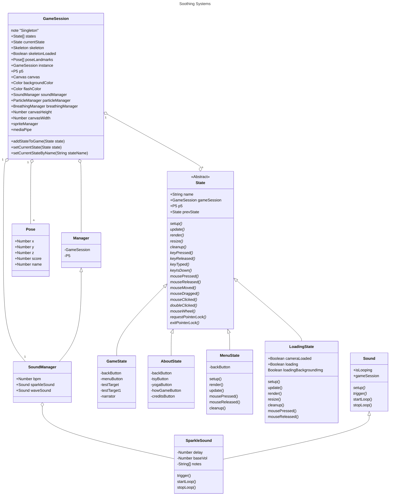
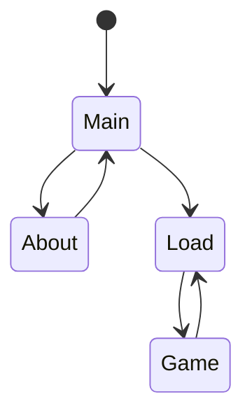

# Soothing Systems

## Class Diagrams

Taking notes on system architecture, will eventually break diagram into subsections at the right level of detail...



## initialization sequence

```mermaid
sequenceDiagram


```

## Menu State Diagram



## Notes;

- the manager base class supplies the singleton objects P5 and Session. Rather than getting these through the class hierarchy, we could just import them as needed in concrete implementations. Could reduce code complexity and make testing easier. Disregard this if managers will supply additional abstract behavior.

- testing game objects currently requires spinning up the whole environment; we might benefit from a lighter testing harness for some components; for example testing a single game object.

- instead of passing gameSession by inheritance hierarchy, just include a singleton constructor? Lots of member chains...

- Collision BB is assumed at root game object. Rotation and scale assumed at base game object; However exceptions exist. consider particles which have no dimensions. Should we add more game objects to avoid 

- Usually root classes are implemented so individual systems(physics, particles, etc) can treat a collection of game objects uniformly. However the current game loop explicitly invokes these methods. Meaning we have an interface but nothing is treated generically. is it just for conceptual purposes?

- UI is homebrew; Is there a reason we are rending UI in the game canvas? is this a conscious effort to get people familiar with UI from scratch or be a solely P5 project? If there isn't an explicit goal we might consider just moving it all to normal HTML5 elements and have the game loop respond to plain old DOM events. easier to style and maintain. can even use your favorite css framework. The experience will probably be more transferrable for students interested in web design too.
  - I can see this needing SPA-like functionality for the UI overlays which would then need to be synced with the game state which is presumably what we were trying to avoid!
  - HTML5 Canvas actually allows you to add DOM elements 'inside' the canvas, and P5 does expose this functionality. So we may be able to still use HTML components directly in the context of your game states.
  - I need to think about this more...

- setup and cleanup calls 