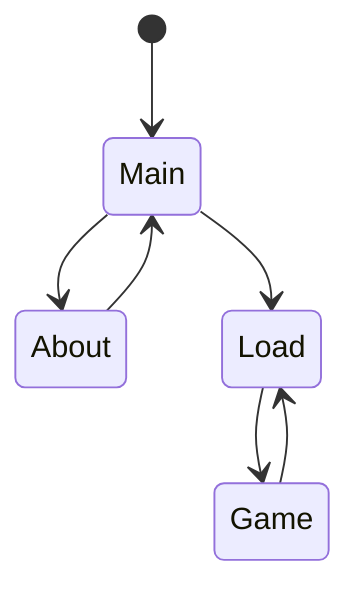

# Soothing Systems Architecture

Here's a first pass on some architecture diagrams. Feel free to contribute!

I intend to add more subsystems and break it into different levels of detail as I work my way through the codebase. Ultimately it is meant to give a 'lay of the land' to contributors at a glance.

These diagrams are made using [Mermaid.js](http://mermaid.js.org/), which automatically generates various diagrams from grammar rules and ascii art! An emergent benefit of this approach is it works pretty well with version control and incremental changes. 

 - <small>[PlantUML](https://plantuml.com/)! is another good diagramming tool.</small>

Mermaid is supported by a lot of flavors of [Markdown](https://www.markdownguide.org/), most importantly [GitHub](https://docs.github.com/en/get-started/writing-on-github/working-with-advanced-formatting/creating-diagrams) and [GitLab](https://docs.gitlab.com/ee/user/markdown.html#mermaid).
So any mermaid code you upload is automatically converted to diagrams when viewed in repo.

A Mermaid previewer is really handy while working on diagrams in VsCode. Here is the extension id of the best one I have used so far;

> **bierner.markdown-mermaid**

You normally don't have to go crazy with diagrams- the full UML recommendations are really heavyweight! However, I often find Class, sequence, and flowchart diagrams invaluable. This is the easiest way I have found to make them so far!

## Class Diagrams


## initialization sequence

**TODO**

```mermaid
sequenceDiagram

```

## Menu State Diagram

**TODO**


