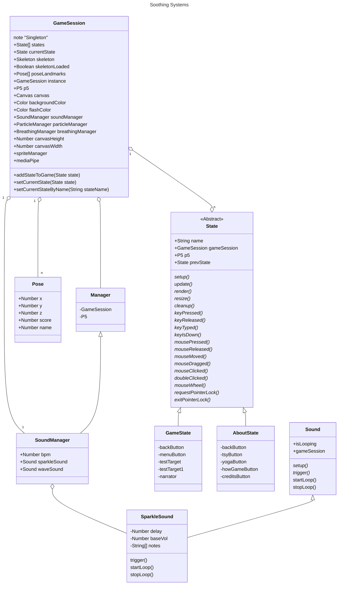
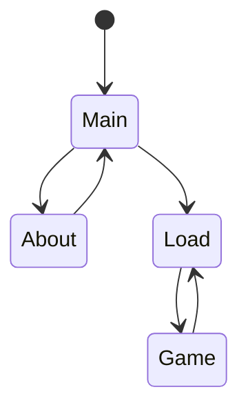

#Soothing Systems

## Class Diagrams

Taking notes on system architecture, will eventually break diagram into subsections at the right level of detail...

## State Diagram

## Notes;

- the manager base class supplies the singleton objects P5 and Session. Rather than getting these through the class hierarchy, we could just import them as needed in concrete implementations. Disregard this if managers will supply additional abstract behavior.

- testing game objects currently requires spinning up the whole environment; we might benefit from a lighter testing harness for some components; for example testing a single game object.

- instead of passing gameSession by inheritance hierarchy, just include a singleton constructor? Lots of member chains...

- collision BB is assumed at root game object

- rotation and scale assumed at base game object; consider particles which have none...